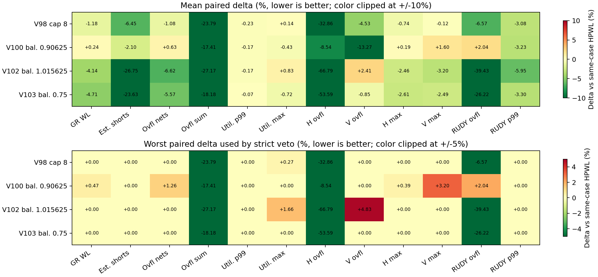
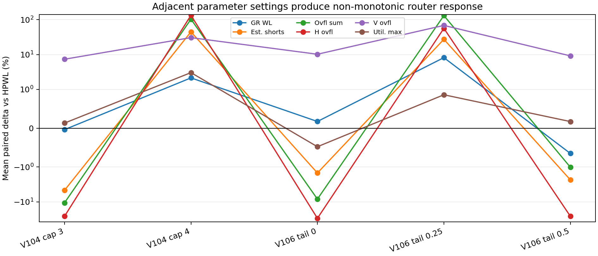
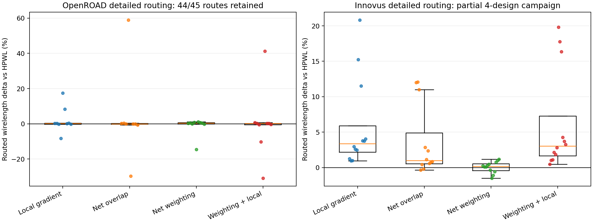
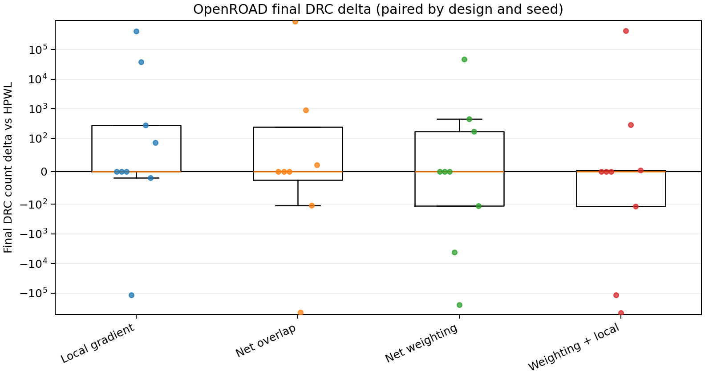
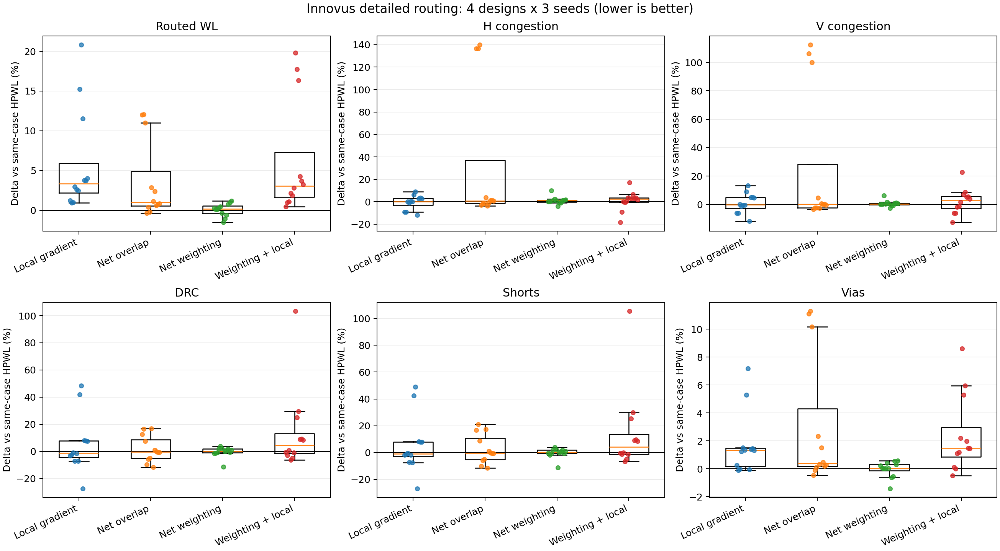
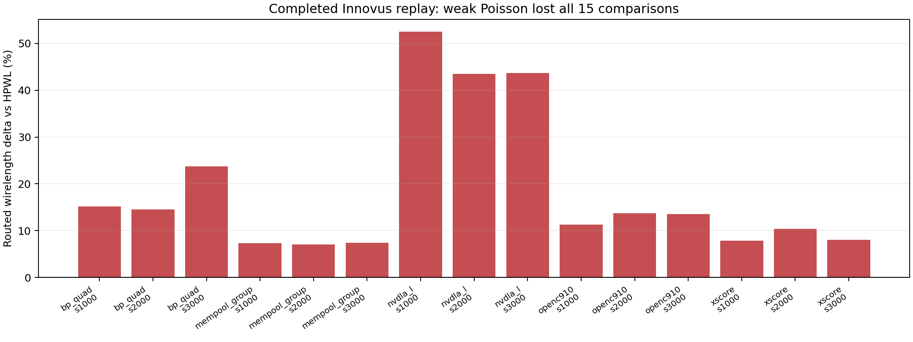
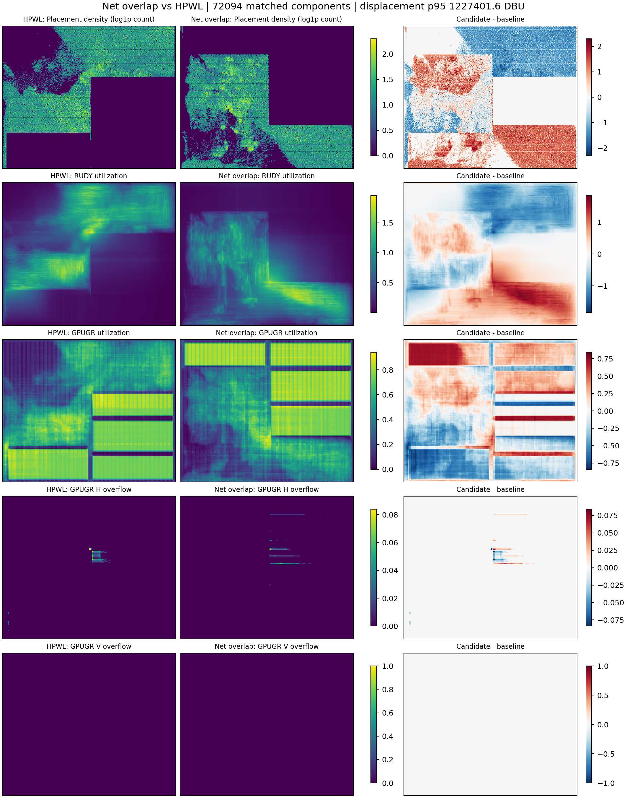

# RUPlace Routability Optimization: Implementation and Validation Report

**Evidence cutoff:** 2026-08-02  
**Campaign source snapshot:** `3583ba6`  
**Development branch:** `feat/routability-lab`  
**Baseline:** unmodified DREAMPlace HPWL placement (`ruplace_plugins=[]`)

## Executive conclusion

The branch now contains **24 independently selectable analytical-placement
plugins**, plus separate legal post-placement operations and a multi-backend
evaluation/selection framework. The implementation covers the major classical
mechanism families: congestion-driven inflation, whitespace allocation,
regional congestion fields, global Poisson forces, tail-risk objectives,
congested-net weighting/relaxation, net-box and routed-segment movement,
virtual-cell movement, and Xplace/GPUGR route gradients.

No method is a validated default.

- The completed historical golden replay rejected weak Poisson on all 15
  BP_quad/Mempool/NVDLA-L/OpenC910/XScore Innovus comparisons. Routed
  wirelength regressed by **+18.663% mean**, **+13.547% median**, and
  **+52.558% worst**.
- The current detailed OpenROAD archive retains 44 of 45 expected routes for
  HPWL, `local_gradient`, `net_overlap`, `net_weighting`, and
  `net_weighting + local_gradient`. `net_weighting` has the best mean routed
  wirelength delta (**-1.169%**), but loses 6/9 comparisons, has a positive
  median (**+0.475%**), and is not DRC-robust.
- The current Innovus detailed archive retains 60 routes for four of the five
  real designs. `net_weighting` is again closest to HPWL at **+0.045% mean**,
  but loses 8/12 routed-WL comparisons, 7/12 H-congestion comparisons, and
  7/12 V-congestion comparisons. Its DRC and shorts each split 6 wins and 6
  losses. All 15 XScore Innovus attempts timed out after 21,600 or 36,000
  seconds, so this remains partial rather than a completed golden campaign.
- The strongest late proxy points were V98 and V103. V98 improved all four
  RUDY and 18/19 GPUGR primary metrics in the mean but had a
  **+0.274506% aggregate maximum-utilization veto**. V103 improved all four
  RUDY and 18/19 GPUGR primaries but had a **+0.152917% vertical p99
  utilization veto**. Under the frozen zero-worst-regression policy both are
  correctly rejected.
- Adjacent parameter values frequently changed from near-miss improvements to
  severe regressions. The response is non-monotonic, so the absence of a
  winner is not explained by a single obviously incorrect sign or an
  unactivated plugin. Placement-effect audits confirmed active candidates
  changed their DEFs.

The production recommendation is therefore unchanged: **keep HPWL with no
RUPlace plugin enabled by default**. `net_weighting`, V98, and V103 remain
research leads, not validated wins.

This gives a precise answer to “does RUPlace work?” The framework works as
software: plugins activate, change same-seed placements, preserve runtime
provenance, emit proxy tensors, and pass the plugin/evaluator regression
suites. It does **not** yet work as a production routability optimizer: no
tested plugin or pair improves routed WL, H/V congestion, and DRC/connectivity
robustly across the golden backends.

## What counts as a routability win

The objective is not placement HPWL alone. A candidate must be compared with
the same-case, same-seed HPWL baseline and improve routability without an
unacceptable regression in any primary dimension:

| Priority | Metrics | Interpretation |
|---|---|---|
| Primary | H/V congestion or overflow | Track-direction capacity pressure |
| Primary | Final DRC, shorts, opens, unrouted nets, connectivity failures | Route correctness and manufacturability |
| Primary | Routed wirelength | Actual routing cost, not placement HPWL |
| Secondary | Routed vias | Required route cost with bounded regression |
| Diagnostic | Placement HPWL, density overflow, runtime | Explains movement/cost but cannot select a winner |

OpenROAD and Innovus are golden validators. RUDY and bundled GPUGR are fast
screening/fallback references. CUGR, NCTUgr, pin-RUDY, and external Xplace are
diagnostic only. Values from different backends are never added into a
synthetic score.

## Software architecture

The integration is deliberately modular:

```text
placement iteration
    -> cached congestion proxy (RUDY, pin density, RUDY+pin, or GPUGR)
    -> independently selected plugin hooks
         prepare_objective
         apply_gradient
         commit_post_gradient
         maybe_adjust_area
    -> common activation, stagnation, force-budget, refresh, and decay policy
    -> placement and per-plugin telemetry
    -> common-backend evaluator
    -> strict per-metric selector
    -> optional OpenROAD/Innovus golden replay
```

The registry is in
[`plugins/__init__.py`](../dreamplace/ops/routability_opt/plugins/__init__.py),
the lifecycle and safety gates are in
[`plugin_base.py`](../dreamplace/ops/routability_opt/plugin_base.py) and
[`pipeline.py`](../dreamplace/ops/routability_opt/pipeline.py), and proxy
construction is in
[`proxy.py`](../dreamplace/ops/routability_opt/proxy.py). Common scheduling
prevents each method from inventing a different activation contract. Telemetry
records selection, attempts, activations, force norms, and whether an active
method actually changed placement.

### Proxy providers

| Proxy | Signal | Implementation detail | Role |
|---|---|---|---|
| `rudy` | Aggregate rectangular routing demand | Native DREAMPlace RUDY; feedback freezes input net weights to avoid a self-amplifying weighting loop | Fast screening |
| `pin_density` | Pin demand map | Existing pin-utilization operator | Feature/ablation |
| `rudy_pin` | Weighted route and pin maps | Resamples to one grid and normalizes weights | Fast composite screening |
| `gpugr` / `xplace` | Routed utilization, H/V overflow, segments, WL, vias | Cached bundled Xplace GPUGR backend | Higher-fidelity screening |
| `nctugr` | Router congestion map | Existing DREAMPlace integration | Diagnostic only |

## Implemented plugin methods

These implementations reproduce **mechanisms**, not exact proprietary or
incompletely specified placers. The complete literature-to-plugin audit, with
DOIs and explicit fidelity limits, is in
[`routability_optimization_lab.md`](routability_optimization_lab.md).

### Area and whitespace mechanisms

| Plugin | Idea | Implementation | Current evidence |
|---|---|---|---|
| `route_inflation` | Add placement area where route demand exceeds capacity | Samples the congestion map through `RUPlaceInflation`, enlarges movable cells/fillers, and rebalances density | Default/weak screens; no survivor |
| `momentum_inflation` | Dampen oscillation between consecutive inflation maps | Exponential momentum state smooths repeated area updates before committing size changes | Screened; no survivor |
| `path_inflation` | Penalize the routing footprint crossed by a cell/net rather than only its center bin | Averages demand over node footprints and applies bounded repeated inflation | Screened; no survivor |
| `pin_porosity` | Reserve space around pin-dense cells and macro-obstructed channels | Combines pin-density and macro-overlap maps, smooths them, and converts pressure into padding/inflation | Screened; no survivor |
| `whitespace` | Move low-frequency whitespace toward congested regions | Smooths the congestion field, differentiates it using physical bin dimensions, and adds a normalized regional spreading force | Screened; no survivor |

Sources:
[`route_inflation.py`](../dreamplace/ops/routability_opt/plugins/route_inflation.py),
[`momentum_inflation.py`](../dreamplace/ops/routability_opt/plugins/momentum_inflation.py),
[`path_inflation.py`](../dreamplace/ops/routability_opt/plugins/path_inflation.py),
[`pin_porosity.py`](../dreamplace/ops/routability_opt/plugins/pin_porosity.py), and
[`whitespace.py`](../dreamplace/ops/routability_opt/plugins/whitespace.py).

### Aggregate and directional field objectives

| Plugin | Idea | Implementation | Current evidence |
|---|---|---|---|
| `local_gradient` | Push nodes down the local congestion gradient | Smooths the selected utilization/overflow map, computes a physical-bin gradient, samples it at nodes, RMS-normalizes, and applies a scheduled relative force | Full current golden set; not robust |
| `poisson_force` | Convert broad congestion into a long-range Coulomb-like field | Solves a Neumann Poisson potential on the routing grid, differentiates it, normalizes it, and injects a bounded placement force | Complete historical golden rejection |
| `directional_local_gradient` | Treat H and V congestion independently | Maps horizontal-track pressure into cross-track y movement and vertical pressure into x movement; supports per-axis normalization, caps, tail controls, and aggregate fallback | Extensive pilots; V98 near miss, no survivor |
| `directional_cvar_gradient` | Optimize the worst utilization tail rather than the grid mean | Builds per-axis CVaR pressure above a quantile, blends overflow, then applies the directional field with a tunable H/V balance | Extensive pilots; V100/V103 near misses, no survivor |
| `directional_excess_cvar_gradient` | Ignore benign tail bins below capacity | Conditions directional CVaR pressure on utilization above one and blends overflow severity | Screened; no survivor |
| `aggregate_cvar_gradient` | Optimize the aggregate utilization tail without imposing an H/V balance | Clamps the quantile threshold to capacity, RMS-matches tail excess and overflow, smooths, differentiates, and applies the common force budget | V106 partial proxy pilot; non-monotonic, no survivor |
| `aggregate_pnorm_gradient` | Continuously emphasize hotspots with an Lp overflow objective | Raises aggregate excess above capacity to exponent p before smoothing and differentiation; p=1 is ordinary overflow | Source/unit validated; V108 stopped before QoR execution |

Sources:
[`local_gradient.py`](../dreamplace/ops/routability_opt/plugins/local_gradient.py),
[`poisson_force.py`](../dreamplace/ops/routability_opt/plugins/poisson_force.py),
[`directional_local_gradient.py`](../dreamplace/ops/routability_opt/plugins/directional_local_gradient.py),
[`directional_cvar_gradient.py`](../dreamplace/ops/routability_opt/plugins/directional_cvar_gradient.py),
[`directional_excess_cvar_gradient.py`](../dreamplace/ops/routability_opt/plugins/directional_excess_cvar_gradient.py),
[`aggregate_cvar_gradient.py`](../dreamplace/ops/routability_opt/plugins/aggregate_cvar_gradient.py), and
[`aggregate_pnorm_gradient.py`](../dreamplace/ops/routability_opt/plugins/aggregate_pnorm_gradient.py).

### Net objective and geometry mechanisms

| Plugin | Idea | Implementation | Current evidence |
|---|---|---|---|
| `net_weighting` | Make congested nets more expensive in the wirelength objective | Scores active nets from the route map, smooths/clamps scores, updates only objective-enabled net weights, and commits/restores through lifecycle hooks | Closest current golden candidate; not a cross-backend winner |
| `net_relaxation` | Reduce wirelength pressure on congested nets so density spreading can dominate | Uses inverse congestion response with a positive weight floor; mutually exclusive with `net_weighting` | Proxy pilots; no survivor |
| `net_overlap` | Move connected net neighborhoods away from overlapping congested boxes | Computes net-box congestion and applies a common movement field to pins/nodes in the affected nets | Full current golden set; severe tails |
| `directional_net_contraction` | Shorten only the net span responsible for H or V pressure | Scores horizontal and vertical spans separately and contracts the matching coordinate toward the net mean/boundary | Proxy pilots; no survivor |
| `directional_path_spreading` | Move routed paths across tracks instead of stretching them along their direction | Uses horizontal congestion to shift net neighborhoods in y and vertical congestion to shift them in x | Proxy pilots; no survivor |
| `routed_overflow_net_contraction` | Act only on GPUGR segments that cross overflowing resources | Reads direction-matched routed segments/overflow, contracts responsible endpoints, supports smoothing and projection against the placement gradient | Extensive pilots; no survivor |

Sources:
[`net_weighting.py`](../dreamplace/ops/routability_opt/plugins/net_weighting.py),
[`net_relaxation.py`](../dreamplace/ops/routability_opt/plugins/net_relaxation.py),
[`net_overlap.py`](../dreamplace/ops/routability_opt/plugins/net_overlap.py),
[`directional_net_contraction.py`](../dreamplace/ops/routability_opt/plugins/directional_net_contraction.py),
[`directional_path_spreading.py`](../dreamplace/ops/routability_opt/plugins/directional_path_spreading.py), and
[`routed_overflow_net_contraction.py`](../dreamplace/ops/routability_opt/plugins/routed_overflow_net_contraction.py).

### Virtual-cell and router-gradient mechanisms

| Plugin | Idea | Implementation | Current evidence |
|---|---|---|---|
| `virtual_cell` | Translate both endpoints of a congested two-pin net from a shared virtual midpoint | Samples a Poisson/local field at the midpoint and moves eligible endpoints together, avoiding direct span expansion | Proxy pilot; no survivor |
| `directional_virtual_cell` | Use H/V cross-track forces at the virtual midpoint | Horizontal pressure translates endpoints in y; vertical pressure translates in x; RUDY falls back to aggregate behavior | Proxy pilot; no survivor |
| `routeforce` | Expose Xplace's differentiable route gradient as an independent ablation | Calls the GPUGR routeforce backend, converts its output to the placement tensor contract, and applies common relative-force scaling | Default/weak screens; no survivor |
| `connection_routeforce` | Move routed pin connections using edge demand/capacity | Retains routed segment feedback with aggregate, directional, or layer-maximum pressure and optional short/via terms | Large bounded tuning sequence; no survivor |
| `multisegment_connection_routeforce` | Preserve all routed branches incident to a global pin | Replaces Xplace's last-branch overwrite with selectable sum/mean reduction | Proxy pilots; no survivor |
| `projected_connection_routeforce` | Prevent router force from directly fighting the placement objective | Projects globally or per node into non-opposing/orthogonal components, inspired by gradient surgery | Proxy pilots; no survivor |

Sources:
[`virtual_cell.py`](../dreamplace/ops/routability_opt/plugins/virtual_cell.py),
[`directional_virtual_cell.py`](../dreamplace/ops/routability_opt/plugins/directional_virtual_cell.py),
[`routeforce.py`](../dreamplace/ops/routability_opt/plugins/routeforce.py),
[`connection_routeforce.py`](../dreamplace/ops/routability_opt/plugins/connection_routeforce.py),
[`multisegment_connection_routeforce.py`](../dreamplace/ops/routability_opt/plugins/multisegment_connection_routeforce.py), and
[`projected_connection_routeforce.py`](../dreamplace/ops/routability_opt/plugins/projected_connection_routeforce.py).

## Separate post-placement operations

These are deliberately not registered as analytical-placement plugins:

| Operation | Purpose | Safety contract | Result |
|---|---|---|---|
| `legal_whitespace_slide` | Project router-guided movement into row whitespace | Whole-site standard-cell moves, fixed row/y/orientation, overlap rejection, hash-bound oracle and acceptance evidence | Tested; no accepted default |
| `legal_whitespace_net_bbox` | Prefer legal moves predicted not to expand connected-net x-span | Same legal projection plus a current-placement net-box delta limit | Tested as an ablation; no accepted default |
| `openroad_routability_oracle` | Obtain legal OpenROAD GPL/GRT movement direction | Oracle placement is never directly accepted; exact tool/script/input/output provenance is retained | Reproduced byte-for-byte on the audited smoke |

Their implementation and contracts are described in
[`routability_optimization_lab.md`](routability_optimization_lab.md#post-placement-operation-contract).

## Literature coverage

The implementation was derived from a venue-oriented review spanning DAC,
ICCAD, ISPD, ASP-DAC, DATE, TCAD, TVLSI, TODAES, and newer learned methods.
The most important mechanism lineages are:

| Literature direction | Representative work | Implemented coverage | Fidelity limit |
|---|---|---|---|
| Cell inflation and iterative congestion mitigation | DAC 2001 cell inflation; ISPD 2002/TCAD 2003 framework | `route_inflation`, momentum/path variants, legacy area adjustment | Mechanism implementation, not the original placer |
| Whitespace allocation | DAC 2002/TCAD 2003 whitespace allocation; CROP | `whitespace`, legal slide | Force/legal approximations, not LP/longest-path CROP |
| RUDY and local fields | DATE 2007 RUDY; ICCAD 2010 local mitigation | RUDY proxy, local and directional gradients | Estimator is native; force models are adaptations |
| Net-overlap and pin/macro porosity | DAC 2008 net-overlap removal; ICCAD 2011 mixed-size placement | `net_overlap`, `pin_porosity` | No exact Gaussian constraint/legalization loop |
| Route/path spreading and contraction | SimPLR, Ripple, Ripple 2.0, PUFFER | path inflation, directional spreading/contraction | No published look-ahead router or Bayesian policy reproduction |
| Hierarchy/net objectives | DAC 2013 hierarchical placement; NTUplace4h; ICCAD 2021 movable-net penalty | net weighting/relaxation and overlap fields | No explicit hierarchy or soft-module model |
| Global Coulomb and virtual-cell forces | DAC 2024 LBR; DAC 2025 differentiable net moving | Poisson, momentum inflation, virtual-cell variants | Rail-aware density and undisclosed details are absent |
| Learned congestion/detailed placement | DATE 2019 CNN, DrPlace, RoutePlacer, RL detailed placement, ICCAD 2023 XAI | Evaluated as missing-family candidates | Not claimed: released data/checkpoints/features or license were unavailable |

The detailed DOI table is maintained in
[`routability_optimization_lab.md`](routability_optimization_lab.md#literature-to-plugin-matrix).
CVaR, Lp-tail, directional-balance, and gradient-projection variants are
controlled research ablations built on these mechanisms, not claimed
reproductions of a named placer.

## Benchmark and validation protocol

### Designs

| Class | Designs | Seeds | Notes |
|---|---|---:|---|
| Contest | ISPD2019 `test1`, `test2`, `test3` | 1000, 2000, 3000 | Common HPWL and plugin placements; OpenROAD-capable |
| Real 2D | BP_quad, Mempool, NVDLA-L, OpenC910, XScore | 1000, 2000, 3000 | Topology-matched TaiWei 2D LEF/DEF/netlist only |

The real designs use the 2D phase `2_2_floorplan_io.def` and matched netlist.
Pseudo-3D, CTS, routed DEFs, and mixed-tier processed LEFs are excluded.

### Selection funnel

1. Confirm plugin registration, activation, force/area change, and a changed
   placement on a small case.
2. Screen atomic parameter points with both RUDY and GPUGR. Keep backend
   metrics separate and require zero worst-case primary regression.
3. Run held-out contest designs/seeds without retuning.
4. Generate bounded combinations only from strict atomic survivors.
5. Replay frozen candidates with common OpenROAD and Innovus configurations.
6. Rank H/V congestion, DRC/connectivity, and routed wirelength as primary;
   vias are secondary and placement HPWL is diagnostic.

The tooling enforces these stages through
[`routability_select_survivors.py`](../tools/routability_select_survivors.py),
[`routability_golden_replay.py`](../tools/routability_golden_replay.py), and
[`routability_rank_golden.py`](../tools/routability_rank_golden.py).

## Proxy-screening results



All values above are paired against HPWL on the same case/seed; lower is
better. The top heatmap shows mean response. The bottom shows the worst
case used by the strict no-regression veto. A displayed `+0.00` can be a true
tie from an inactive easy-case slot, not missing data.

| Campaign | Completion | Best point | Mean primary improvements | Strict veto | Decision |
|---|---:|---|---|---|---|
| V93 monotonic tail guard | 14/14 evaluator rows | None | 0/4 RUDY; at most 1/19 GPUGR | At least 18 GPUGR guards per point | 0/6, terminal reject |
| V98 utilization refinement | 14/14 | quarter strength, cap 8 | 4/4 RUDY; 18/19 GPUGR | GPUGR util. max +0.274506% worst | 0/6 |
| V100 directional CVaR balance | 14/14 | balance 0.90625 | 2/4 RUDY; 15/19 GPUGR | GR WL +0.474822%, overflow nets +1.25998%, H max +0.387227%, V max +3.20088% | 0/6 |
| V103 transition balance | 14/14 | balance 0.75 | 4/4 RUDY; 18/19 GPUGR | V utilization p99 +0.152917% | 0/6 |
| V102 x-bias | 10/14 when stopped | balance 1.015625 | 4/4 RUDY; 15/19 GPUGR | util. max +1.65916%, V overflow/RC +4.82776%, V p99 +0.309235% | Partial, no survivor |
| V104 application budget | 10/14 when stopped | cap 3 | 4/4 RUDY; 12/19 GPUGR | Seven vetoes; cap 4 then collapsed | Partial, no survivor |
| V106 aggregate CVaR | Partial when stopped | q99/tail 0 control | 4/4 RUDY; 9/19 GPUGR | Ten vetoes; tail 0.25 collapsed | Partial, no survivor |
| V107 / V108 | Stopped | Not run/completed | None | None | No QoR claim |



V104 cap 3 to cap 4 and V106 tail blend 0 to 0.25 show order-of-
magnitude response changes. The same source, proxy, activation policy, design,
and seed were held fixed. This supports two conclusions: the methods are
actually affecting placement, and local parameter interpolation is not a safe
way to infer a winner.

## Current golden-router results

### OpenROAD detailed routing

The retained archive contains 44/45 expected `openroad_metrics.json` files.
The missing route is one `net_overlap` comparison. Each row below is paired
with HPWL for the same design and seed.

| Method | Comparisons | Routed-WL mean | Median | Worst | WL wins | Final-DRC W/T/L | DRC mean delta* |
|---|---:|---:|---:|---:|---:|---:|---:|
| `local_gradient` | 9 | +2.034% | +0.195% | +17.474% | 3/9 | 2/3/4 | +9.579% |
| `net_overlap` | 8 | +3.641% | -0.033% | +58.997% | 5/8 | 2/3/3 | +60.937% |
| `net_weighting` | 9 | -1.169% | +0.475% | +1.191% | 3/9 | 3/3/3 | +0.454% |
| `net_weighting + local_gradient` | 9 | +0.090% | +0.263% | +41.202% | 4/9 | 3/3/3 | +14.597% |

`*` DRC percentage means include only pairs whose HPWL DRC baseline is
nonzero. The W/T/L count uses absolute DRC counts and retains clean-zero ties.





The favorable OpenROAD mean for `net_weighting` is not robust: six of nine
wirelength comparisons lose, the median is positive, and its DRC result is
mixed. Large positive and negative DRC tails also show why a mean-only ranking
would be unsafe.

### Partial Innovus detailed routing

The stopped current campaign retains 60 successful evaluator summaries: four
designs x three seeds x five methods. XScore produced no successful golden
route: all 15 Innovus attempts timed out, with `net_weighting` reaching 21,600
seconds and the other four methods reaching 36,000 seconds on every seed. Each
retained `evaluation/summary.json` contains routed wirelength, H/V congestion, DRC,
shorts, vias, opens, unrouted nets, and connectivity violations. The report
generator reads those structured summaries rather than the narrower
`innovus_metrics.txt` files.

| Method | Routed WL mean | H congestion mean | V congestion mean | DRC mean | Shorts mean |
|---|---:|---:|---:|---:|---:|
| `local_gradient` | +5.865% | -0.491% | +0.865% | +5.304% | +5.711% |
| `net_overlap` | +3.622% | +34.082% | +26.088% | +1.738% | +2.576% |
| `net_weighting` | +0.045% | +1.196% | +0.613% | -0.361% | -0.284% |
| `net_weighting + local_gradient` | +6.212% | +0.953% | +2.209% | +14.127% | +14.464% |

| Method | WL W/T/L | H W/T/L | V W/T/L | DRC W/T/L | Shorts W/T/L |
|---|---:|---:|---:|---:|---:|
| `local_gradient` | 0/0/12 | 4/2/6 | 6/1/5 | 7/0/5 | 7/0/5 |
| `net_overlap` | 2/0/10 | 5/0/7 | 5/1/6 | 7/0/5 | 7/0/5 |
| `net_weighting` | 4/0/8 | 3/2/7 | 3/2/7 | 6/0/6 | 6/0/6 |
| `net_weighting + local_gradient` | 0/0/12 | 3/1/8 | 5/0/7 | 5/0/7 | 6/0/6 |



`net_weighting` is the only current method close enough to justify future
completion, but `+0.045%` is not an improvement, 8/12 cases lose, XScore is
absent, H/V congestion usually regresses, and DRC/shorts are evenly split.
It cannot be promoted.

## Completed historical Innovus result

The earlier frozen HPWL-versus-weak-Poisson campaign is complete: five real
designs, three seeds, 30 positive Innovus routes, and 15 paired comparisons.



| Metric | Mean | Median | Worst | Pair W/T/L |
|---|---:|---:|---:|---:|
| Routed wirelength | +18.663% | +13.547% | +52.558% | 0/0/15 |
| Vias | +1.090% | +0.296% | +9.363% | 6/0/9 |
| Horizontal congestion | +23.031% | -3.804% | +200.000% | 9/1/5 |
| Vertical congestion | +18.480% | -9.915% | +130.636% | 9/0/6 |

Poisson flattened the RUDY hotspot score and reduced density overflow but lost
actual routed wirelength on every design and seed. This is direct evidence
that proxy-map smoothing is not itself a routability win.

## Innovus placement-pattern study

The reference TaiWei `2_2_floorplan_io.def` files are Innovus 2D placements,
not empty floorplans. A 32x32 cell-area audit found that commercial placement
is strongly nonuniform and design-dependent:

| Design | Components | Fixed macros | Empty std-cell bins | Std-cell CV | P95/mean | Macro-covered bins |
|---|---:|---:|---:|---:|---:|---:|
| BP_quad | 795,816 | 220 | 49.1% | 1.492 | 4.086 | 49.0% |
| B19 | 72,652 | 0 | 0.2% | 0.195 | 1.341 | 0.0% |
| OpenC910 | 938,955 | 31 | 31.9% | 0.988 | 2.476 | 15.8% |
| Mempool | 2,579,164 | 324 | 37.8% | 1.074 | 2.738 | 26.2% |
| NVDLA-L | 2,229,371 | 174 | 41.7% | 1.632 | 4.601 | 60.4% |
| XScore | 3,617,126 | 201 | 0.7% | 0.482 | 1.732 | 23.4% |

The relevant design lesson is not “make density uniform.” Macro-heavy layouts
need broad empty regions and irregular channels, while macro-light designs can
be much more uniform. This supports directional, macro-aware, and locally
bounded methods, but the golden results show that the current approximations
do not yet reproduce Innovus's routing-aware tradeoffs.

## Visualization limits after cleanup

The archive-derived figures above are reproducible metric visualizations. The
2026-08-02 completion campaign additionally retained frozen DEFs and proxy
tensors, enabling the following real spatial comparison.



For ISPD19 Test2 seed 3000, `net_overlap` moved all 72,094 placed components
into a substantially different regional pattern: matched-instance displacement
has a 560,679-DBU median and 1,227,402-DBU p95 on a 1,745,600 x 1,178,400-DBU
die. It reduced RUDY overflow sum
by 29.559%, RUDY overflow-bin count by 36.389%, GPUGR routed-WL proxy by
4.754%, and GPUGR overflowing-net count by 21.533%. Those apparent wins are
not coherent: RUDY p99 utilization worsened by 2.632% and GPUGR estimated
shorts increased by 295.991%. The saved H/V maps also show that this case's
GPUGR overflow is horizontal while the vertical plane is zero. This is direct
evidence that the plugin made a broad topology-changing movement rather than
a bounded local repair, and that reduced aggregate overflow did not imply
short-safe routing.

The earlier cleanup intentionally removed the large candidate DEF/PL files,
congestion tensors, and router databases for the archived campaigns.
Consequently, it is impossible to reconstruct an honest candidate-vs-HPWL
placement image, H/V congestion-bin heatmap, or DRC marker map for those
specific routes from the retained compact metrics. Creating one would require
inventing spatial information. The 2026-08-02 completion runs instead preserve
placed DEFs plus RUDY and GPUGR tensors so new spatial plots can be generated
without changing the archived evidence.

Future golden runs should preserve, for each selected baseline/candidate pair:

- the final placed DEF and legalized DEF;
- RUDY utilization and overflow tensors with grid geometry;
- GPUGR aggregate and H/V utilization/overflow tensors;
- OpenROAD FastRoute congestion report/guide and TritonRoute DRC markers;
- Innovus congestion-map export, detailed DRC report, and routed DEF;
- exact LEF/netlist/config/tool hashes.

That compact “spatial survivor pack” is enough to plot placement density,
H/V congestion, and DRC overlays without retaining full router databases.

## Why no candidate won

The evidence does not support a single implementation bug as the explanation.

1. Activation and placement-effect audits passed. Active methods reported
   nonzero forces/updates and changed their Test2 DEFs; easy Test1 cases that
   did not pass the activation gate remained byte-identical to HPWL.
2. Several methods improved most proxy metrics at once. V98 and V103 reached
   22/23 mean primary improvements across RUDY and GPUGR, which would be
   unlikely if every directional map or force sign were wrong.
3. The remaining failures were tail failures: maximum utilization, vertical
   p99, one seed's DRC, or routed wirelength. Those are precisely the failures
   the strict policy is designed not to average away.
4. Golden backends disagree in magnitude and sometimes direction. OpenROAD's
   `net_weighting` mean is favorable while partial Innovus is slightly
   unfavorable. A proxy-only or one-router-only selector would overfit.
5. Adjacent settings are non-monotonic. Stronger/weaker forces can move cells
   across discrete legalization and routing thresholds, producing abrupt route
   topology changes.

There can still be defects or model mismatch in individual approximations,
but the current “no winner” result is technically plausible and is supported
by independent activation, proxy, OpenROAD, and Innovus evidence.

## Recommendation and next validation step

1. Keep unmodified HPWL as the production default.
2. Classify XScore as golden-router infeasible under the demonstrated
   21,600/36,000-second Innovus budgets. Preserve its completed RUDY/GPUGR
   fallback rows and spatial packs; do not launch another identical replay.
3. If a future `net_weighting` variant becomes primary-safe, validate it on held-out real
   designs and a second technology/router setup. Its present 4/12 Innovus and
   3/9 OpenROAD wirelength win rates are not sufficient.
4. Preserve spatial survivor packs before cleanup so the next report can
   correlate node movement with H/V overflow and DRC locations.
5. Treat V98 and V103 as sensitivity probes. Their tiny proxy vetoes justify
   mechanistic analysis, not bypassing the gate or immediately spending a full
   golden campaign.
6. New optimization work should focus on explicit bounded multiobjective or
   trust-region updates tied to router feedback, plus legal/local refinement,
   rather than another unconstrained scalar-force sweep.

## Reproducibility and retained evidence

The report figures and their exact derived values are generated by
[`routability_generate_report_figures.py`](../tools/routability_generate_report_figures.py).

```bash
python3 tools/routability_generate_report_figures.py \
  --archive /mnt/nvme2n1/yifan/ruplace-local-cleanup-archive/\
20260801_stop_cleanup_3583ba6/compact_evidence.tar.gz \
  --output-dir docs/images/routability_report
```

The generator also accepts the extracted evidence tree through
`--evidence-root`. It writes
[`figure_data.json`](images/routability_report/figure_data.json), which records
the plotted paired values and aggregate tables.

The saved DEF/tensor spatial comparison is generated by
[`routability_plot_spatial.py`](../tools/routability_plot_spatial.py). On
2026-08-02 the local `placement` environment passed 111/111 plugin tests,
37/37 evaluator tests, 50/50 preset-generation tests, 66/66 golden
replay/summarization/ranking tests, and 2/2 report/DEF-parser tests.

Retained archives:

- Local: `/mnt/nvme2n1/yifan/ruplace-local-cleanup-archive/20260801_stop_cleanup_3583ba6/compact_evidence.tar.gz`
- Remote: `/mnt/nvme2n1/yifan/ruplace-remote-cleanup-archive/ceca2080x4_20260801_stop_cleanup_3583ba6/compact_evidence.tar.gz`

The earlier Poisson-only report in
[`routability_validation_final.md`](routability_validation_final.md) is
historical. The long-form campaign chronology remains in
[`routability_validation_status.md`](routability_validation_status.md).
